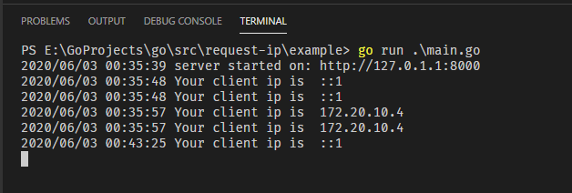

# Request - IP


This package is useful to get the client IP address of incoming HTTP requests in GoLang.

## Inspired by [Petar Bojinov](https://github.com/pbojinov/request-ip)

# How It Works

It looks for specific headers in the request and falls back to some defaults if they do not exist.

The client ip is determined by the following order:

1. **X-Client-IP**
1. **X-Forwarded-For** (Header may return multiple IP addresses in the format:"clientIP, proxy1 IP, proxy2 IP", so we take the the first one.)
1. **CF-Connecting-IP** (Cloudflare)
1. **Fastly-Client-Ip** (Fastly CDN and Firebase hosting header when forwared to a cloud function)
1. **True-Client-Ip** (Akamai and Cloudflare)
1. **X-Real-IP** (Nginx proxy/FastCGI)
1. **X-Cluster-Client-IP** (Rackspace LB, Riverbed Stingray)
1. **X-Forwarded**, **Forwarded-For** and **Forwarded** (Variations of #2)
1. **req.RemoteAddr**

> If an IP address cannot be found, it will return empty string.

# Installation

Use the **go** command:

> go get "github.com/vikram1565/request-ip"

# Getting Started

```go
package main

import (
	"log"
	"net/http"

	rip "github.com/vikram1565/request-ip"
)

func main() {
	http.HandleFunc("/", func(w http.ResponseWriter, r *http.Request) {
		log.Println("Your client ip is ", rip.GetClientIP(r))
	})
	log.Println("server started on: http://127.0.1.1:8000")
	serverError := http.ListenAndServe(":8000", nil)
	if serverError != nil {
		log.Println("Failed to start server: ", serverError)
	}
}
```

> on localhost you'll see ::1 or 127.0.0.1 if you're using IPv4 , ::ffff:127.0.0.1 if you're using IPv6

# Output



> You may have noticed that when you browse to different domains, your browser is sending requests for http://<your.domain.com>/favicon.ico, behind the scenes. Thats why my log is printed twice.

# Benchmarks


# Links

1. [net/http](https://golang.org/pkg/net/http/)
1. [http-headers](https://developer.mozilla.org/en-US/docs/Web/HTTP/Headers)
1. [remote address](https://husobee.github.io/golang/ip-address/2015/12/17/remote-ip-go.html)

# Contributors

- Special thanks to [@Akshay Bharambe](https://github.com/akshaybharambe14) for code review.

# Copyright

Copyright (C) 2020 by Vikram Ingawale [[GitHub](https://github.com/vikram1565)]

request-ip package released under MIT License. See [LICENSE](https://github.com/vikram1565/request-ip/blob/master/LICENSE) for details.
